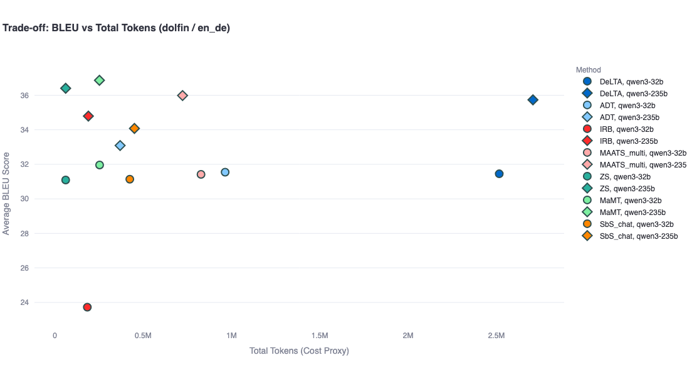

# Agent-MT Interactive Analysis Panel

This interactive panel provides a visual comparison of translation quality, latency, and success rates vs. cost (token usage) across different agentic workflows and models.

## 0. Prerequisite: Generate Output Data

The interactive panel reads analysis results directly from the `outputs/` folder in the project root. Before running the application, you must generate or sync this folder.

Sync the latest `report.json` files from the remote server to your local `outputs/` directory. Run this command from the project root:

```bash
rsync -zarv -m -e "ssh  -i your-key.pem" --include="*/" --include="report.json" --exclude="*" user@remote-host:./air/zhijin/agent-mt-main ./
```

*(Note: Replace `your-key.pem` with your actual private key file and `user@remote-host` with the correct username and hostname.)*

## 1. Installation

Ensure you have the necessary dependencies installed:

```bash
pip install streamlit pandas plotly matplotlib seaborn
```

## 2. Launch the Panel

Run the following command to start the Streamlit web application:

```bash
streamlit run interactive_panel/app.py
```

## How to Use
- **Data Source**: The application automatically scans the `outputs/` directory for any `report.json` files.
- **Configuration**: Use the sidebar to select the **Dataset** and **Language Pair**.
- **Experiment Type**: Filter between "Standard" translation and "Terminology"-focused runs.
- **Metrics**: Switch between the following metrics to see how they correlate with token costs:
    - **BLEU**
    - **chrF**
    - **Term Success Rate**
    - **Latency (s)**: Average time per sample.
    - **Success Rate (%)**: Percentage of samples processed successfully.
- **Interactive Plot**: Hover over data points to see detailed information about the method, model, and exact scores.

## Example Plots

Here are some examples of the analysis plots generated from the data:

### English to German (Dolfin)


